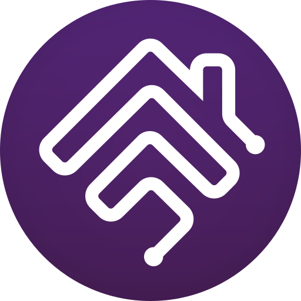

   

# Homebridge-SmartHQ Client

A homebridge plugin for GE appliances using the SmartHQ API s (Identity and Access Management API, Digital Twin API) from npm pkg 'ge-smarthq'.  The following devices are implemented:
* refrigerator
* dishwasher
* Other devices will be discovered and service information could be written to the log to assist in adding support for more devices.

The refrigerator services include controls for:
* refrigerator temperature
* freezer temperature
* controls lock
* convertible drawer modes
* dispenser light
* icemaker
* interior light
* sabbath mode
* temperature units
* turbo cool modes refrigerator & freezer
* water filter maintenance (see notes)
* additional switches are used to implement notifications

The dishwasher services include controls for:
* Wash cycle presets
* Wash temperatures
* Dry temperatures
* Wash zones
* Options for steam, bottlewash, silverware, sabbath mode, controls lock


## Installation

Option 1: Homebridge UI

Go to the 'Plugins' page, search for homebridge-smarthq-client, and click 'Install'.  

Option 2: Manually

Run the following command to install the plugin globally:
```
$ sudo npm install homebridge-smarthq-client -g
```


    
## Requirements
The SmartHQ API uses an OAuth 2.0 authentication process. The steps required to setup an account in order to use the API are

* Follow the steps at  [Get Started - SmartHQ Docs](https://docs.smarthq.com/get-started/)  
  (The Callback URL specified in step 2.4 must match the corresponding field in the plugin config setup (recommended http://localhost:8888/callback)

* When step 2 from Get Started is complete and you have created an app, click on the app to display your   apps page. Find the Credentials tab and copy the **Client Id**, **Client Secret** and **Callback URL** to the plugin config.
## Configuration

Use the Homebridge UI to configure this plugin. See **Requirements** for steps to obtain a Client Id and Client Secret.

* Select the services you want to add for the appliance in the plugin config.

* Select Logging options.  
   * *Plugin Debug Logging*  will log additional messages to the Homebridge log.
   * *Display Service Details for all discovered device services* will log sorted information about all services for each discovered device.  
    (This info is used to add support for other appliances.) 
  *  *Display Service Details for only refrigerator services* will only log sorted information about all services for refrigerator. 
   * *Display Service Details for only dishwasher services* will only log sorted information about all services for dishwasher. 

* Save plugin config and restart child bridge.

Or manually edit the config file with
```
{
    "name": "GE SmartHQ",
    "redirectUri": "http://localhost:8888/callback",
    "addControlLock": true,
    "addConvertibleDrawer": true,
    "addDispenserLight": true,
    "addIceMaker": true,
    "addInteriorLight": true,
    "addSabbathMode": true,
    "addTemperatureUnits": true,
    "addEnergyMonitor": true,
    "addTurboCool": true,
    "addWaterFilter": true,
    "addAlerts": true,
    "addDwSabbath": true,
    "addDwSound": true,
    "addDwFanFresh": true,
    "addDwControlLock": true,
    "debugLogging": true,
    "clientId": "your client Id",
    "clientSecret": "your client Secret",
    "_bridge": {
        "name": "Homebridge GE SmartHQ",
        "username": "0E:1B:48:E5:A4:B9",
        "port": 50928
    },
    "debugServicesFridge": false,
    "debugServicesDishwasher": false,
    "debugServicesAll": false,
    "platform": "SmartHqPlatform"
}
```


## Initial Authentication
(*If access token does not exist*). Check the Homebridge log for a highlighted localhost URL.
```
======================================================================= 
Click to login for SmartHQ Auth setup ===>: http://localhost:8888/login
=======================================================================  
```
Click on the URL to be redirected to a SmartHQ authorization screen. 
Login to your SmartHQ account to complete the process. 
Once an access (and refresh) token have been saved this step will only be needed if the file
used to store your tokens is deleted. 
When an access token expires the plugin will use the refresh token to obtain a new access token automatically.

## Notifications (for refrigerators)

API device alerts are monitored for the following conditions:  
* Door left open
* Temperature alert (either fridge or freezer)
* Water pitcher leak
* Filter maintenance
* Firmware

If selected during configuration, switches are added that will be turned on temporarily  
when a corresponding alert is triggered.
Using these switches in conjunction with a 3rd party service (e.g PushOver, PushCutter etc)  
an Apple Home automation can be set up to issue notifications for your iOS devices.

These switches will appear in Accessories as *Alert Door*, *Alert Temp*, *Alert Leak*, *Alert Filter*, *Alert Firm*
## Documentation

[SmartHQ Documentation](https://developer.smarthq.com/)

## Notes 
(for refrigerator) 
The *water filter maintenance* option uses the Filter Maintenance Service in the Homebridge API.  
The service exists in HomeKit but has not been implemented in the Apple Home app.   
If selected in the plugin config you will notice a tile on the Homebridge Accessories page but there   
will not be any tile/device shown in the Home app. 
 
2/11/26 Added a lightbulb service Brightness characteristic to show remaining water filter %.  (this will be displayed in HomeKit)


## Acknowledgements

[donavanbecker](https://github.com/donavanbecker) for the excellent 'ge-smarthq' pkg.   
GE SmartHQ API Client


## Feedback

If you have any feedback, please reach out at: ceb40win@outlook.com

If you have GE smart appliances other than refrigerator or dishwasher you can capture
the following information (after adding the appliance to your SmartHQ account)
* Update the plugin config to select *'Display Service Details for all discovered device services'*
* Restart the child bridge.
* Copy log output including 'SmartHQ Discovered device: *newDevice* Model: *deviceModelNumber*'  
    plus all logged services and forward the file to me. 
As my time permits I will attempt to add support for new devices.

Or fork the repository to add support for other devices.

